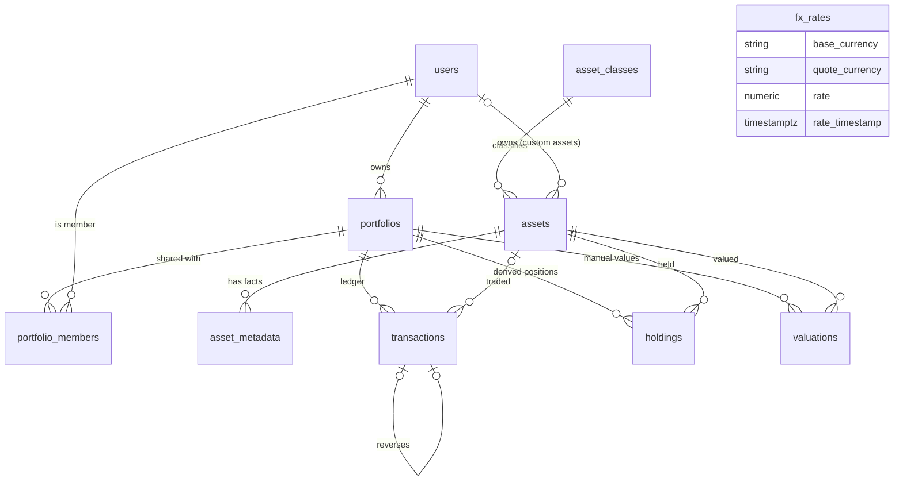

# Core Data Model (P05-T01)

Status: Approved by the user 2026-10-10 (P05-T01). Migration `0004`. Models live with their modules (ADR-0004): `portfolio`, `assets`, `transactions`, `market_data`.

## 1. Entities

| Table | Purpose | Key rules |
|---|---|---|
| `portfolios` | A user's portfolio: name, base currency, type, archive date | Type is one of personal, family, retirement, geographic, strategy. Name is unique per user. Archived, never deleted. |
| `portfolio_members` | Other users with access (viewer or editor) | The owner is `portfolios.user_id`, not a member. Sharing itself is built later. |
| `asset_classes` | The kinds of asset (stocks, bonds, real estate, ...) | A new class is a row, not a schema change. `valuation_mode`: market or manual. |
| `assets` | One catalogue table for every asset | Global (no owner) or user-defined (owner set, visible only to them). Native currency. At most one row per provider reference. |
| `asset_metadata` | Type-specific facts (coupon, maturity, sector, address) | One JSON value per key per asset, with source and as-of. |
| `transactions` | **Append-only ledger**, the source of truth | 14 types. Own currency and the FX rate to the portfolio currency, with its time and source. Idempotency key. Reversal link. |
| `holdings` | Derived position per asset per portfolio | A cache: always rebuildable from the ledger (P05-T05). |
| `valuations` | User-entered values for assets without a market price | One per asset per as-of instant; source label. |
| `fx_rates` | Timestamped exchange rates | Positive; one row per pair, provider and instant. P11 extends it. |

Money is `NUMERIC(28,8)`, quantities `NUMERIC(28,12)`, rates `NUMERIC(28,12)` (ADR-0006). There are no floating-point columns. Every core table has a UUID primary key (`gen_random_uuid()`) and `created_at`/`updated_at`.

## 2. Ledger rules enforced by the database

- **Append-only:** `UPDATE`, `DELETE` and `TRUNCATE` on `transactions` are rejected by triggers.
- **Corrections are reversals.** A reversal row points at the original (`reverses_transaction_id`) and carries the original's figures; the holdings logic (P05-T05) treats it as the negation. Therefore amounts, quantities and prices stay non-negative, except a `VALUATION_ADJUSTMENT`, whose amount can be a loss.
- An entry can be **reversed once**, and a reversal must be in the **same portfolio** (composite foreign key).
- **Idempotency:** the same key twice in one portfolio is rejected (the API turns this into "return the first posting", P05-T04). Different portfolios can reuse a key.
- A **BUY or SELL** must name an asset, a quantity above zero and a unit price.
- Fees and taxes are not negative. The FX rate is above zero. Settlement is not before the trade date. Currencies are 3 capital letters.
- **No silent deletion:** a user cannot be deleted while they own portfolios, a portfolio not while it has a ledger, an asset not while it is traded or valued (all `RESTRICT`). Removing a person's data is the explicit account-deletion workflow (P15-T05).

## 3. Decisions for your review

1. **Append-only at the database level now** (not only in the API of P05-T04). Benefit: no code path, script or future developer can edit history. Cost: erasure and any bulk correction need a deliberate, privileged procedure (planned for P15-T05).
2. **Corrections as reversals that copy the original's figures** (negated by the holdings logic), so no column holds a negative except valuation adjustments. Alternative: store the opposite-signed amounts; rejected because every sum and constraint would then need sign rules.
3. **Asset classes are a table**, not a database enum, so adding the 16th or 17th class needs no migration. The 16 initial rows are seeded in P05-T02 (the implementation guide lists 15; I will list what I seed and why).
4. **Global and user-defined assets in one table**, with `owner_user_id` deciding visibility. A house or private business belongs to one user; a listed share belongs to nobody. Services must check that a portfolio only trades assets its owner can see (P05-T04).
5. **`holdings` is a derived cache**, not a second source of truth. If it ever disagrees with the ledger, the ledger wins and it is rebuilt.
6. **Metadata as rows** (`asset_metadata`) instead of the single `metadata JSONB` column in the implementation guide, so each fact carries its source and as-of date and can be validated per class.
7. **Portfolio sharing is modelled (viewer/editor) but not built.** Until it is, ownership checks use `owned_by` only; shared access will extend them (ADR-0011).
8. **FX table is the minimum** for P05-T06 (pair, rate, provider, timestamps). Currencies list, snapshots, rate type and status come in P11-T02 as designed in `multi-currency-design.md`.

## 4. Not in this migration

Market prices (P09), income events, liabilities, goals, AI tables and notifications arrive with their own phases. Account deletion, retention and erasure: P15-T05.
