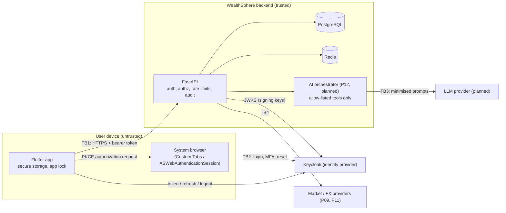

# WealthSphere Threat Model (v1, P04-T09)

Status: Approved by the user 2026-10-10 (P04-T09) (P04-T09, 2026-10-10). Scope: everything built through P04, plus the planned AI surface (P12) so its controls are designed in, not added later. Reviewed again at P10 (AI tool layer), P14 (cloud) and P15 (hardening, OWASP API Top 10 / MASVS review, penetration test).

Method: STRIDE per surface. Each threat lists the control, where it is tested, and its status: **In place** (implemented and tested), **Partial** (implemented, a gap is known), **Planned** (owned by a later task). Findings found while building P04 are in [security-findings.md](security-findings.md).

## 1. What we protect

| Asset | Why it matters |
|---|---|
| Users' financial data (holdings, transactions, net worth, goals) | Confidential; the product's core value. Leaks or cross-user access are the top risk. |
| Session tokens (access, refresh, ID) | Whoever holds them acts as the user. |
| Credentials and MFA secrets | Held only by Keycloak; never by the app or API. |
| Integrity of financial calculations | Wrong numbers drive real decisions; the backend is authoritative. |
| Audit trail | Evidence of who changed what; must not be altered. |
| AI answers (planned) | Must not leak other users' data, invent facts or present forecasts as guarantees. |
| Secrets (DB, Redis, provider keys) | Lead to everything above. |

## 2. System and trust boundaries

Trust boundaries:
- **TB1, device to API:** everything from the device is untrusted (it may be rooted, instrumented or replaced by a script).
- **TB2, browser to identity provider:** credentials cross only this boundary.
- **TB3, API to LLM:** model output is untrusted text.
- **TB4, API to external data providers:** provider data is untrusted until validated and timestamped.

## 3. Threats and controls

### 3.1 Identity (Keycloak)

| # | STRIDE | Threat | Control | Tested by | Status |
|---|---|---|---|---|---|
| I1 | S | Password guessing / credential stuffing | Brute-force detection: 5 failures, temporary lockout 1 to 15 min (never permanent, so accounts cannot be locked by others); password policy (12+ chars, mixed, history 5) | `test_keycloak_realm.py`; `keycloak_dev.py smoke` (lockout checks) | In place |
| I2 | S | Stolen password alone is enough | TOTP MFA available; set up from More > Account | smoke (TOTP enrolment, wrong code refused) | **Partial**: MFA is optional (user decision 2026-10-10, SF-10; revisited at P15) |
| I3 | S/E | Authorization code interception (custom scheme hijack) | Public client with PKCE S256 required; exact redirect URI; implicit and password grants off | realm tests; smoke (no-PKCE refused, implicit and password grants refused) | In place |
| I4 | I | Long-lived tokens leak | Access 5 min; refresh rotation with reuse detection (`revokeRefreshToken`, max reuse 0); SSO idle 30 min, max 10 h; no `offline_access` scope requested | realm tests; mobile `keycloak_oidc_client_test` | In place |
| I5 | T | Realm misconfiguration drifts | Realm as code (`infra/keycloak/realm-export.json`), tests over the export; `sync-realm` | `test_keycloak_realm.py` | In place (dev); production realm hardening (HTTPS only, admin access, SMTP) is P14 |
| I6 | R | Account takeover via password reset | Reset only on Keycloak's page with email verification; app builds the reset link from configuration only | `auth_screens_test` (URL) | In place; email delivery is configured with SMTP in P14 |

### 3.2 API (FastAPI)

| # | STRIDE | Threat | Control | Tested by | Status |
|---|---|---|---|---|---|
| A1 | S | Forged, tampered, expired or replayed-for-another-audience tokens | RS256 only; `exp`, `iat`, `iss`, `sub`, `aud` required; issuer, audience, `azp` and expiry checked (`nbf` when present); JWKS cached with one refetch for unknown `kid`; 30 s leeway; fail closed when unconfigured; one uniform 401 | `test_auth_tokens.py` (31 cases), `test_auth_coverage.py` | In place |
| A2 | S/E | A new endpoint ships without authentication | Protected by default (`current_user`); every route not on the public allow-list must answer 401 to no/garbage/expired/foreign-key/wrong-scheme tokens | `test_auth_coverage.py` | In place |
| A3 | I/E | IDOR: reading or changing another user's resource | Ownership in the query (`owned_by`); updates repeat `user_id`; 404 indistinguishable from missing (ADR-0011); owner never taken from the body | `test_authz_risk_profiles.py`; `test_idor_coverage.py` fails CI for any id route without a registered cross-user test | In place |
| A4 | D | Request floods, token guessing against the API | Redis rate limits: auth routes 10/60 s per IP, failed authentications 10/300 s per IP (then 429 for all requests), 600/60 s per IP, 120/60 s per account; per-process fallback if Redis is down | `test_api_protection.py` | In place; per-IP is only as good as client-IP attribution behind the load balancer (P14, `--proxy-headers`) |
| A5 | D | Oversized bodies | 1 MiB limit by Content-Length and while streaming | `test_api_protection.py` | In place |
| A6 | T/I | Browser-based attacks on API responses | `nosniff`, `X-Frame-Options: DENY`, deny-all CSP, `no-referrer`, CORP, `Cache-Control: no-store`, HSTS in deployed environments; CORS off (explicit https origins only, no credentials) | `test_api_protection.py` | In place |
| A7 | I | Error responses or logs leak secrets or financial data | RFC 7807 errors without internals; validation errors never echo values; log redaction for credentials, tokens and amounts | `test_redaction.py`, `test_identity_api.py`, `test_auth_coverage.py` | In place |
| A8 | R | A user denies a change; changes cannot be traced | Append-only `audit_events` (DB triggers reject UPDATE/DELETE/TRUNCATE, ORM guards); correlation ID per request; written in the same transaction as the change | `test_audit.py` | In place; the application DB role should not own the table (P15), retention and erasure (P15-T05) |
| A9 | T | Injection (SQL) | SQLAlchemy expressions only; no string-built SQL; typed Pydantic input with `extra="forbid"` | identity and authz tests | In place; SAST (CodeQL) runs in CI |
| A10 | T | Financial result tampering by the client | Backend authoritative; money as Decimal/NUMERIC; the app never computes financial truth | P05 onwards (financial tests, QG-06) | Planned |

### 3.3 Mobile app

| # | STRIDE | Threat | Control | Tested by | Status |
|---|---|---|---|---|---|
| M1 | I | Tokens read from device storage or backups | Tokens only in `flutter_secure_storage` (Keystore-encrypted / Keychain `first_unlock_this_device`, not synced); Android backup and device transfer disabled; unreadable entries discarded | `token_set_test` (store, options) | In place on Android (emulator-verified); iOS Keychain not yet run on a device |
| M2 | I | Tokens leak through logs or errors | No HTTP logging interceptor; `TokenSet`, `AuthException`, `ApiException` never print tokens; UI state holds no tokens | `api_client_test` (prints and errors scanned for every token) | In place |
| M3 | S | Someone picks up an unlocked phone | App lock (biometrics / device PIN): on restore, on resume after the chosen timeout, after 5 min idle; only success unlocks; without device security only sign-out remains | `app_lock_test`, `app_lock_gate_test`; emulator (PIN) | In place; fingerprint enrolment and Face ID not yet exercised on hardware |
| M4 | I | App-switcher snapshot shows balances | Privacy cover while inactive; Android 13+ Recents screenshot disabled | `app_lock_gate_test`; emulator (Recents shows the cover) | In place |
| M5 | S | Phishing inside the app (fake login form) | No credentials entered in the app: hosted pages in the system browser (address bar visible); ephemeral session on iOS | `auth_screens_test`, `keycloak_oidc_client_test` | In place |
| M6 | T/I | Network interception | HTTPS required in release builds (config refuses http); debug allows cleartext only to loopback dev hosts | `token_set_test` (AppConfig) | In place; certificate pinning decided in P15 |
| M7 | E | Refresh token replay after theft | Rotation: each refresh returns a new token and kills the old one; a refused refresh ends the session on the device | `token_manager_test`, `api_client_test`; emulator (revoked session signs out) | In place |
| M8 | T | Rooted/jailbroken device, instrumentation, repackaging | Out of scope for v1 controls; tokens protected by hardware keystore where available | — | Planned (P15 MASVS review: root/jailbreak signals, tamper detection) |
| M9 | I | Deep links carry attacker-controlled input | Strict parsing of route parameters (AI scope); invalid values ignored; backend authorises every resource anyway | `test/app/app_routes_test.dart` | In place |

### 3.4 Data stores and infrastructure

| # | STRIDE | Threat | Control | Status |
|---|---|---|---|---|
| D1 | I | Secrets in source control | `.env` git-ignored; gitleaks in CI (full history) and pre-commit; no defaults for secrets | In place (QG-08.3) |
| D2 | I | Database or Redis exposed | Local stack binds to loopback; managed services, network policy and TLS in P14 | Planned (P14) |
| D3 | I | Data at rest | Encryption at rest and backups (P14-T05, P14-T10) | Planned |
| D4 | T | Supply chain (dependencies, actions) | Pinned action SHAs, pip-audit/OSV, Trivy, CodeQL, SBOM in CI | In place (scanning); dependency policy at P14-T04 |

### 3.5 AI surface (planned, P10 and P12)

Designed-in controls; each becomes a tested control in its task.

| # | STRIDE | Threat | Planned control |
|---|---|---|---|
| X1 | I/E | Prompt injection makes the model fetch another user's data | The model never touches the database: allow-listed tools only, each re-checking ownership server-side with the authenticated user (docs/ai-governance.md); IDOR tests per tool |
| X2 | I | Model output leaks data across users or sessions | Per-user conversation scope; no shared context; tool results minimised before reaching the provider |
| X3 | T | Invented facts, prices or returns | Facts only from tools with provider evidence and as-of timestamps; answers separate facts, calculations, assumptions and interpretation; output schema validation; no guaranteed-return language |
| X4 | E | Model-chosen URLs or actions | No arbitrary URL fetching; no trade execution; tools are read-only unless a future approved requirement says otherwise |
| X5 | R | AI recommendations cannot be traced | Audit event per tool call (tool, actor, arguments hash, result status, model version, correlation ID); `hash_arguments` exists since P04-T04 |
| X6 | D | Cost or rate abuse through the AI endpoint | Per-user rate limits and budgets on the orchestrator |
| X7 | I | Sensitive data sent to the LLM provider | Data minimisation and provider data-handling terms (P10-T01) |

## 4. Residual risks and decisions needed

| Item | Risk | Owner / when |
|---|---|---|
| MFA optional | A stolen password is enough for accounts without TOTP | Accepted by the user on 2026-10-10 (optional for now); revisit at P15 |
| iOS not exercised on a device | Keychain options and Face ID behaviour are unit-tested, and CI compiles iOS, but they have not been run on an iPhone | Run on a device or simulator before P04-GATE closes QG-05.4, or defer with approval |
| Client IP attribution behind a proxy | Per-IP limits could be bypassed or shared wrongly | P14 (load balancer, `--proxy-headers`) |
| App DB role owns `audit_events` | The owner could disable the triggers | P15 (separate least-privilege role) |
| No certificate pinning, root/jailbreak detection | Higher risk on compromised devices | P15 MASVS review |
| Dev stack uses HTTP for Keycloak and API | Dev only; release builds refuse HTTP | P14 (TLS everywhere) |

## 5. Security test suite

Run in CI as its own step in each workflow (P04-T09):
- Backend `uv run pytest -m security`: token validation, route authentication coverage, authorization/IDOR (with the registry guard), identity, rate and body limits, headers, CORS, audit, redaction and the realm export (P04); portfolio, ledger, holdings, valuation and summary isolation, and the integrity suite (P05-T09: an IDOR sweep over every registered route with before/after snapshots of the victim's data, and seeded random ledger sequences checking the ledger invariants after every step). `tests/test_security_suite.py` fails if a security module loses its marker.
- Mobile `flutter test --tags security`: 128 tests over the token set and secure store, refresh and rotation, the PKCE client, the API client (including no-token-leak checks), app lock, sign-in screens and MFA set-up. `test/guards/security_suite_test.dart` fails if a file loses its tag.
- Not in CI (needs the local Keycloak): `python scripts/keycloak_dev.py smoke` (19 live checks incl. PKCE, grants, TOTP and brute-force lockout) and `tests/test_identity_keycloak_live.py`.
